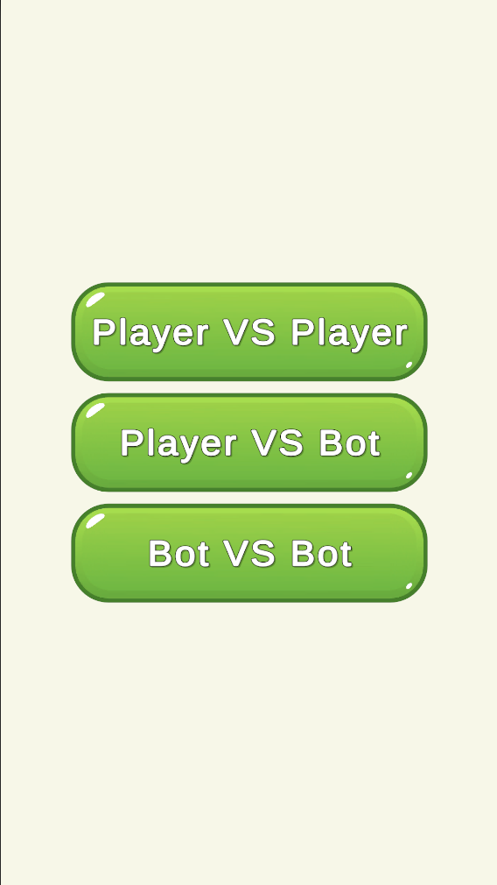
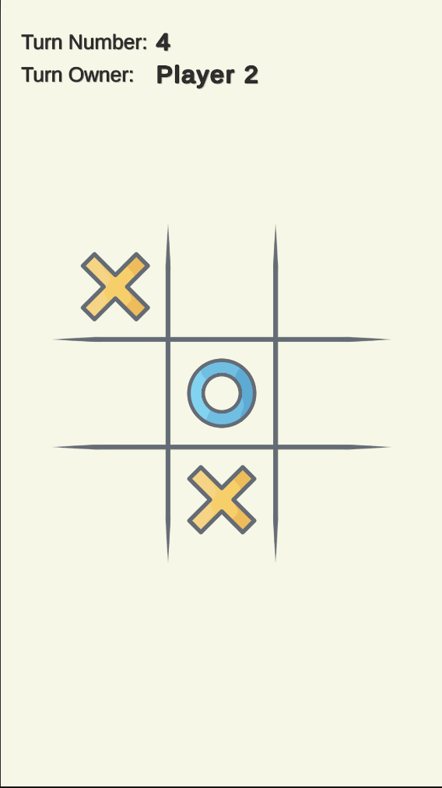
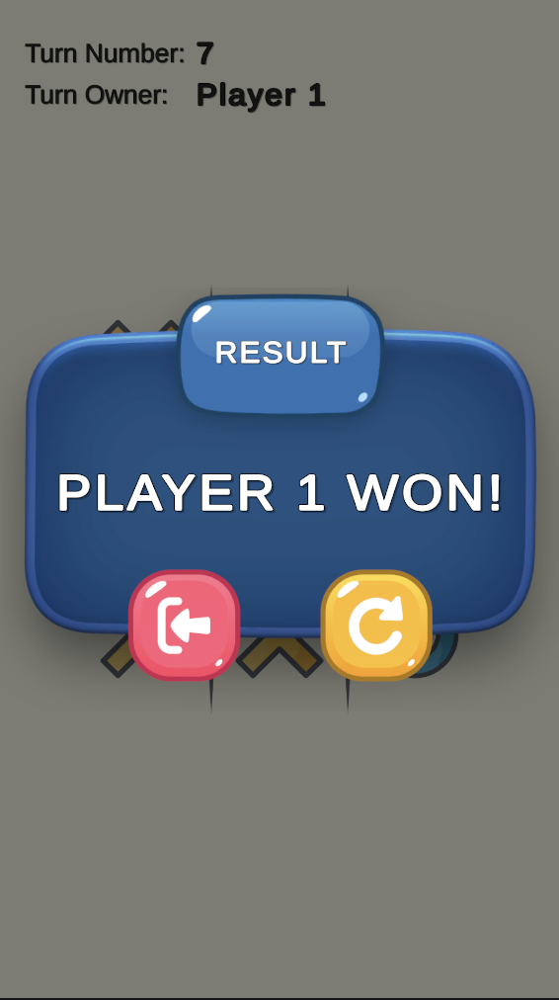
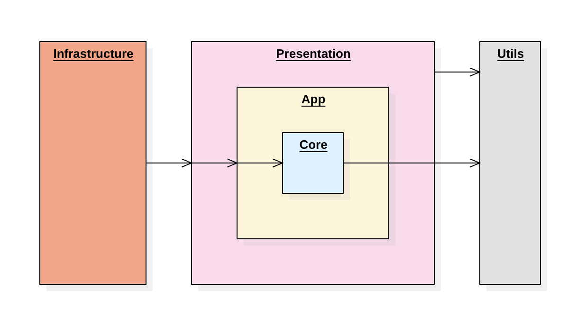
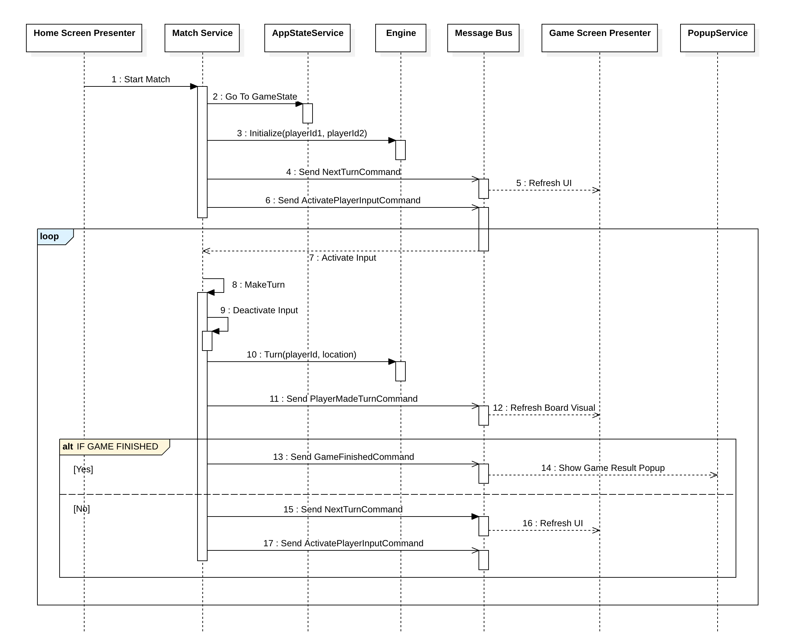

# Tic Tac Toe Game
The idea of the project is just to demonstrate skills of designing game architecture.

### Overview
The game looks pretty simple. It has 2 screens: HomeScreen and GameScreen. Home screen consists of 3 buttons to run the match in 3 different ways:
1. *Local Player vs Local Player* - 2 players are playing on the same device using the same input strategy.
2. *Local Player vs AI* - you can play with a really stupid bot, but it can be easily upgraded by adding a strategy of mode smart AI player input.
3. *AI vs AI* - here you can watch how 2 AI players play with each other. AI is really simple. It just finds a random free cell on the board and uses it.

  
  
  

### Dependencies
- *Unity 2022.3.23f1*
- *VContainer* - for resolving the dependencies in the project.
- *VitalRouter* - really fast and convenient implementation of message bus.
- *UniTask* - current implementation of VitalRouter framework requires UniTask that I don't really like but as is.

### How To Run
Open a scene called Main and enter the play mode.

### Architecture
The idea was to separate game domain logic from business logic and of course from UI.
So that, in my realization I don't inject any dependencies in **MonoBehaviours** and use them only like passive views. And to manage the views I'm using presenters.
So, to build the project I tried to follow clean layered architecture. The project consists of 5 modules (asmdefs). Three of them are base layers of the game and two others - common modules that exist almost in each project.

  

As you can see on the diagram above the project has 3 main layers: **Core**, **App** and **Presentation**. All the dependencies go from outer layer to inner, i.e. from **Presentation** to **Core**, so that the **Presentation** layer doesn't know anything about **Core** layer.
1. **Core** - the core domain logic of the game. The heart of the game. Doesn't have dependencies to other layers so it can be easily covered by Unit Tests. The only dependency it has is Utils.
2. **App** - the business logic of the game. Manages game flow. Has only the Core layer as a dependency.
3. **Presentation** - a layer that visualizes all that happens in the game. Depends on App layer and Utils module to use the same helpful methods that are using in Core layer.
4. **Utils** - really thin module, currently only has one static class BoardUtils with some helpful static methods. Has no dependencies.
5. **Infrastructure** - the entry point of the game. Installs all the dependencies and creates top-level presenters. Depends on all the layers of the game.
The high level flow looks like this:
1. **App** layer changes the state of the **Core** layer.
2. At the same time the **App** layer sends a notification about the change.
3. Then the **Presentation** layer (Presenters) handles the notifications and updates
corresponding views.

### Game Flow
Below you can see a sequence diagram of how the game flow goes:

  

1. We click any of 3 buttons to start the match and call *StartMatch* method on **MatchService** and pass to the method type of the match.
2. **MatchService** says to **AppStateService** to switch state to *GameState*.
3. At the same time **MatchService** initializes the engine state by calling *Initialize*
method on it and passing ids of 2 players.
4. At the same time **MatchService** sends *NextTurnCommand* to **Message Bus**.
5. **GameScreenPresenter** catches *NextTurnCommand* and syncs the UI with the new
engine state.
6. At the same time **MatchService** sends *ActivatePlayerInputCommand* that will be
processed sequentially after *NextTurnCommand*.
7. Here I use a feature called *Interceptors* in the framework *VitalRouter*, that intercepts
an *ActivatePlayerInputCommand* and calls *ActivateInput* on **MatchService**.
8. Then the **MatchService** waits for a turn decision from the active player input. And
when a decision is made the method *MakeTurn* is called on **MatchService**.
9. In the *MakeTurn* method **MatchService** deactivates current active input to lock any
input between the turns.
10. Also In the *MakeTurn* method **MatchService** calls method Turn on engine to process
the domain logic passing there an id of player and a chosen cell position.
11. Also In the *MakeTurn* method **MatchService** sends *PlayerMadeTurnCommand*.
12. **GameScreenPresenter** catches *PlayerMadeTurnCommand* and adds a player's
symbol to the board visual.
13. **MatchService** checks if the game finished then sends **GameFinishedCommand**.
14. When **GameScreenPresenter** sees the *GameFinishedCommand* opens
*GameResultPopup*.
15. If the game is not finished then **MatchService** sends *NextTurnCommand*.
16. **GameScreenPresenter** refreshes UI.
17. **MatchService** sends *ActivatePlayerInputCommand* and then we are going into a loop
starting on the number 7.
